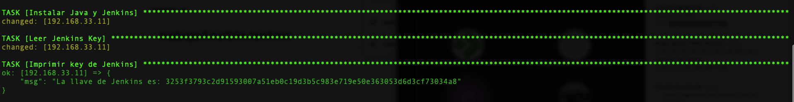

# Instrucciones

* Instalar maquina master (master/Vagrantfile)
* Instalar maquina nodo   (nodo/Vagrantfile)
	Nota: en nodo/shared/instalar_jenkins.sh esta el shell para instalar Java y Jenkins
* Copiar archivo ansible/playbook.yml en maquina master
* Dentro de maquina master ejecutar playbook.yml

Salida del comando ansible:

